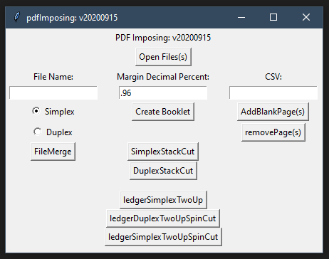

# pdfImposing
## WIP
A fun personal project to replicate software I use quite frequently.

* The PyPDF2 library is used to provide interaction with PDF files.
* Common PDF Preflight/Imposing Logic is built on-top of that.
* A GUI using tkinter is used to interact with the software.

This (currently) cross platform software runs stand-alone, and (currently) does not need anything else installed to run.

If you are looking for a more robust commercial solution [Quite Imposing ](http://www.quite.com/imposing/) This does require Adobe Acrobat to be installed. 